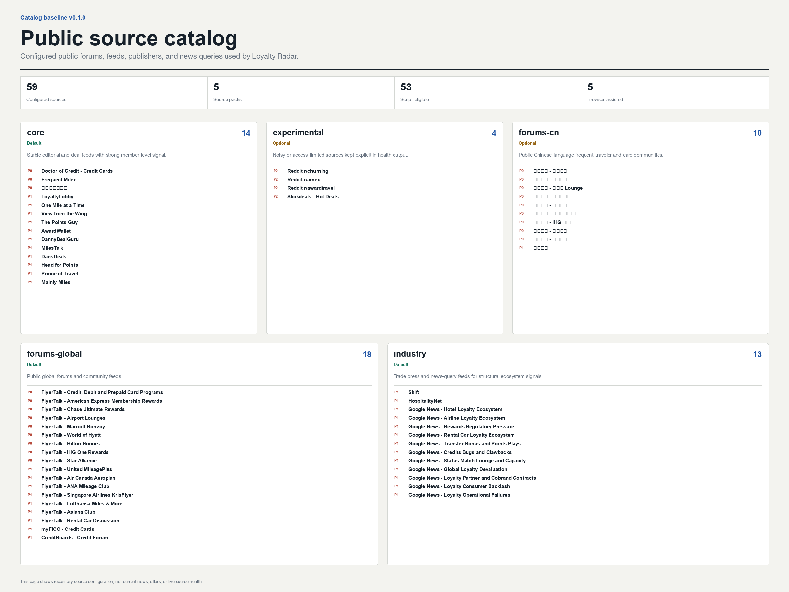

# Loyalty Radar

[简体中文](README.zh-CN.md) | English

> Turn public loyalty-program noise into source-backed, prioritized events for points, miles, travel cards, hotels, airlines, and rental cars.

**Public beta:** `v0.1.1` is the current patch release; `v0.1.0` was the first public release. Interfaces and source availability may change during the beta.



Loyalty Radar scans public forums, RSS feeds, editorial sources, news indexes, and public datapoints. It groups repeated coverage into one event, ranks the events against a user-controlled profile, and produces a bilingual report with source and collection-health evidence.

It has two reporting lanes:

- **Member radar:** promotions, transfer bonuses, statement credits, status matches, award availability, lounges, bugs, clawbacks, and risk datapoints.
- **Ecosystem radar:** devaluations, partner-contract changes, reimbursement conflicts, benefit-capacity pressure, regulation, loyalty economics, and consumer backlash across the global loyalty industry.

Loyalty Radar does not verify every item against an official program page. It reports what public sources say, labels the evidence quality, and preserves links for review.

## 30-second quick start

Choose one installation form. All three use the same Skill and Python implementation.

### Codex Skill-only Plugin

Install the tagged public Marketplace:

```bash
codex plugin marketplace add lonelydoctor/loyalty-radar --ref v0.1.1
codex plugin add loyalty-radar@loyalty-radar
```

Then ask Codex:

```text
Run my two-week loyalty intelligence report in English.
```

For local development, run `codex plugin marketplace add "$PWD"` from this checkout before the same `codex plugin add` command.

### Agent Skills / Claude-compatible Skill

The portable Skill lives at:

```text
plugins/loyalty-radar/skills/loyalty-radar
```

Copy that directory into the skills directory used by your agent. Common examples:

```bash
mkdir -p ~/.agents/skills
cp -R plugins/loyalty-radar/skills/loyalty-radar ~/.agents/skills/loyalty-radar
```

```bash
mkdir -p ~/.claude/skills
cp -R plugins/loyalty-radar/skills/loyalty-radar ~/.claude/skills/loyalty-radar
```

After publication, agents and installers that accept a direct Skill URL can use:

```text
https://github.com/lonelydoctor/loyalty-radar/tree/main/plugins/loyalty-radar/skills/loyalty-radar
```

### Python CLI

Install from a checkout with [uv](https://docs.astral.sh/uv/):

```bash
uv tool install .
loyalty-radar init
loyalty-radar run --mode daily --locale en
```

The package requires Python 3.11 or newer. A published tag can later be installed directly from Git:

```bash
uv tool install "git+https://github.com/lonelydoctor/loyalty-radar.git@v0.1.1"
```

## Common commands

```bash
# One collection pass, two localized report sets
loyalty-radar run --mode daily --locale zh-CN --locale en

# Weekly presentation over the same default 14-day evidence window
loyalty-radar run --mode weekly --locale en

# Narrow the member-level radar
loyalty-radar run --focus credit-card --locale en
loyalty-radar run --focus hotel --locale zh-CN
loyalty-radar run --focus bug --locale en

# Inspect and validate source packs
loyalty-radar sources list
loyalty-radar sources check
loyalty-radar sources validate path/to/source-pack.yaml

# Re-render an existing audit JSON without recollecting sources
loyalty-radar render --input-json path/to/report.json --locale en
```

The default evidence window is the previous 14 days. Explicit future dates mentioned in those items are tracked for the following 60 days.

## Output contract

Each locale receives its own visible artifacts; one shared JSON file keeps the audit trail.

| Artifact | Purpose | Language behavior |
| --- | --- | --- |
| `*.html` | Responsive, filterable full report | Target locale only; includes language links when both locales exist |
| `*.png` | 2400 x 1800 overview infographic | Target locale only |
| `*.md` | Portable text report | Target locale only |
| `*.json` | Structured audit and integration interface | Original text plus `localized[locale]`, source health, and translation health |

Visible reports never silently fall back to the wrong language. Translation failures use a localized placeholder while the original remains available in JSON.

## Feature matrix

| Capability | Public-beta scope |
| --- | --- |
| Evidence collection | Public RSS, HTML forums, blog comments, news-index queries, and explicitly marked browser-assisted sources |
| Event model | Conservative clustering of repeated evidence into one event |
| Prioritization | Profile relevance, urgency, value, risk, evidence confidence, future dates, and ecosystem impact |
| Member radar | Offers, transfer bonuses, credits, status, award space, lounges, bugs, clawbacks, and risk datapoints |
| Ecosystem radar | Hotel, airline, card, and rental-car structural loyalty signals |
| Localization | Simplified Chinese (`zh-CN`) and English (`en`) visible reports |
| Translation providers | `google-public`, `openai-compatible`, and `none` |
| Rendering | HTML, PNG, Markdown, and schema-versioned JSON; Pillow fallback when Playwright is unavailable |
| Personalization | User-owned profile, membership, card, region, topic, and source-pack configuration |
| Scheduling and delivery | Not included in v0.1.x; runs are started manually by an agent or user |
| Hosted service and telemetry | Not included |

## 59-source catalog

The catalog contains 59 configured source entries at the v0.1.0 baseline. An entry is not a promise that a site will always be reachable: every run records success, failure, skip, browser-assisted status, and row counts instead of silently dropping unavailable sources.

The read-only weekly GitHub health workflow probes a bounded sample rather than scraping the full catalog. Its sample is balanced across script-eligible Source Packs and rotates each ISO week so lower-priority and industry sources are not permanently hidden behind a P0-heavy prefix. Endpoint failures remain evidence about availability, not claims that a source published no news.

| Source pack | Default | Typical coverage | Notes |
| --- | --- | --- | --- |
| `core` | Enabled | High-signal loyalty and travel-card RSS sources | Stable starting set for most users |
| `industry` | Enabled | Loyalty economics, regulation, partner contracts, devaluation, and benefit delivery | Includes focused news-index queries |
| `forums-global` | Enabled | Global airline, hotel, card, and points-and-miles communities | Forum availability can vary |
| `forums-cn` | Optional by locale/profile | Chinese frequent-traveler and US-card communities | Includes GBK and browser-assisted handling where required |
| `experimental` | Disabled by default | Noisy, rate-limited, or unstable public sources | Must remain visibly marked in health output |

The catalog aims for broad coverage of major global programs, not every local loyalty program or every item published on the internet. See [Contributing a source](docs/source-contribution.md) to add a regional source without changing the core package.

## Internationalization

All renderer-owned labels, filters, statuses, errors, and image text come from locale catalogs. Source brands, account handles, metrics, and URLs keep their canonical form.

| Locale | CLI value | README | Report path convention |
| --- | --- | --- | --- |
| English | `en` | `README.md` | filename includes `-en` |
| Simplified Chinese | `zh-CN` | `README.zh-CN.md` | filename includes `-zh-CN` |

Translation happens after ranking so only selected event and evidence text is sent to a translation provider. Cache keys include provider, model, source locale, target locale, and a hash of the original text.

The default `google-public` provider is an unofficial, no-key endpoint. Availability is not guaranteed, and selected text is transmitted to a third party. Use `none` to disable remote translation or `openai-compatible` with a provider you control, including a compatible local Ollama endpoint.

## Configuration and personal data

`loyalty-radar init` creates user configuration outside the repository using the platform-standard application configuration directory. Personal memberships, card holdings, translation caches, and real reports must not be committed.

Repository data assets are limited to:

- empty or generic configuration templates;
- source metadata and public URLs;
- visual assets generated from that committed source metadata;
- clearly isolated, non-production fixtures under `tests/`, which runtime and public-site code never load.

No news, offer, datapoint, or report snapshot is published in the repository or on GitHub Pages. Real reports remain local to the user who runs them.

See [Privacy](PRIVACY.md) for the full data-flow and retention model.

## Responsible collection boundaries

Loyalty Radar collects only publicly accessible material. Its collectors must not:

- sign in to a forum or use a user's cookies;
- solve or bypass CAPTCHAs;
- evade anti-bot controls, access controls, or rate limits;
- collect private messages, account pages, or non-public benefits;
- teach users to evade a bank, program, merchant, or forum's controls.

Collectors use declared methods, source-specific limits, a recognizable User-Agent, and explicit health states. A `403`, Cloudflare challenge, robots restriction, or parser failure is surfaced as a failed, skipped, or browser-assisted source.

You are responsible for reviewing source terms and applicable law in your jurisdiction before enabling a source pack.

## Public source catalog

GitHub Pages publishes a bilingual Source Catalog Explorer generated directly from the committed 59-source configuration. It shows source names, public URLs, pack membership, priority, language, region, and declared fetch method. It does not publish generated loyalty intelligence or claim that a source is currently healthy.

Release assets use stable paths:

- `docs/assets/overview-en.png`
- `docs/assets/overview-zh-CN.png`
- `docs/assets/report-desktop-en.png`
- `docs/assets/report-mobile-en.png`
- `docs/assets/catalog-en.gif`

The `/en/` and `/zh-CN/` Pages routes expose the same source configuration in different interface languages. Current news and personalized prioritization are generated only by a local run.

## Architecture

The same implementation is packaged once inside the portable Skill and exposed through three entry points: Codex Plugin, Agent Skill, and Python CLI. See [Architecture](docs/architecture.md) for module boundaries, data flow, JSON compatibility, and trust boundaries.

```text
.agents/plugins/marketplace.json
plugins/loyalty-radar/
  .codex-plugin/plugin.json
  skills/loyalty-radar/
    SKILL.md
    agents/openai.yaml
    scripts/loyalty_radar/
    references/
docs/
tests/
pyproject.toml
```

## Contributing

Issues and pull requests are welcome during the public beta. Start with [CONTRIBUTING.md](CONTRIBUTING.md), especially the fixture-only PR test rule and the [source contribution guide](docs/source-contribution.md).

- Report security issues privately as described in [SECURITY.md](SECURITY.md).
- Follow [CODE_OF_CONDUCT.md](CODE_OF_CONDUCT.md).
- Review the [migration guide](docs/migration-from-loyalty-intel-digest.md) before moving from the personal predecessor Skill.

## License and affiliation

Code and original documentation are available under the [MIT License](LICENSE).

Loyalty Radar is an independent open-source project. It is not endorsed by or affiliated with any airline, hotel group, bank, card network, rental-car company, forum, publisher, alliance, or loyalty program. Product and company names identify the programs discussed and remain the property of their respective owners. See [TRADEMARKS.md](TRADEMARKS.md).
