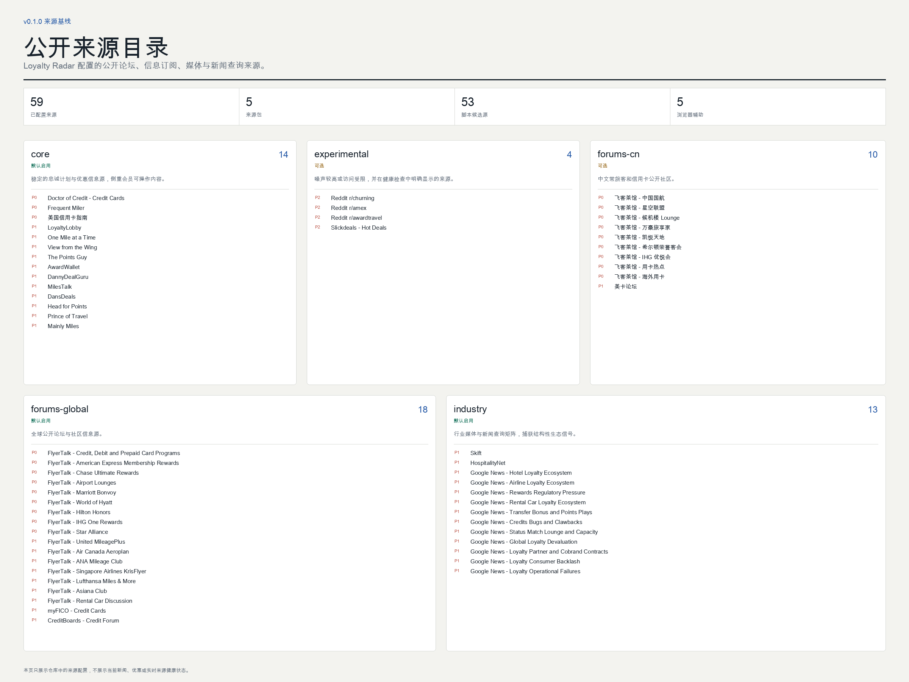

# Loyalty Radar

简体中文 | [English](README.md)

> 将公开渠道中的常旅客噪声整理为有来源、可排序的事件，覆盖积分里程、旅行信用卡、酒店、航司与租车忠诚计划。

**公开测试版：** `v0.1.1` 是当前补丁版本，`v0.1.0` 是首个公开版本。测试期间，接口和来源可用性仍可能调整。



Loyalty Radar 抓取公开论坛、RSS、行业媒体、新闻索引和用户实测信息，将重复报道聚合为单一事件，再根据用户自己维护的画像排序，最终生成双语报告，并保留来源与抓取健康证据。

报告分为两条主线：

- **C 端雷达：** 促销、转点奖励、账单抵扣、会籍匹配、积分房、休息室、系统异常、追回和风控实测。
- **生态雷达：** 全球忠诚计划中的贬值、合作协议变化、成本补偿冲突、权益容量压力、监管、忠诚计划经济与消费者反弹。

Loyalty Radar 不会默认逐条前往官网核验。它负责整理公开来源中的说法、标注证据质量，并保留原始链接供用户判断。

## 30 秒快速开始

选择一种安装形态即可，三种形态共用同一个 Skill 和 Python 实现。

### Codex Skill-only Plugin

安装已打标签的公开 Marketplace：

```bash
codex plugin marketplace add lonelydoctor/loyalty-radar --ref v0.1.1
codex plugin add loyalty-radar@loyalty-radar
```

然后在 Codex 中输入：

```text
生成过去两周的常旅客情报报告。
```

本地开发时，在当前检出目录先运行 `codex plugin marketplace add "$PWD"`，再执行同一条 `codex plugin add` 命令。

### Agent Skills / Claude 兼容 Skill

可移植 Skill 位于：

```text
plugins/loyalty-radar/skills/loyalty-radar
```

将该目录复制到目标 Agent 使用的 Skills 目录。常见示例：

```bash
mkdir -p ~/.agents/skills
cp -R plugins/loyalty-radar/skills/loyalty-radar ~/.agents/skills/loyalty-radar
```

```bash
mkdir -p ~/.claude/skills
cp -R plugins/loyalty-radar/skills/loyalty-radar ~/.claude/skills/loyalty-radar
```

仓库发布后，支持直接 Skill URL 的 Agent 或安装器可使用：

```text
https://github.com/lonelydoctor/loyalty-radar/tree/main/plugins/loyalty-radar/skills/loyalty-radar
```

### Python CLI

使用 [uv](https://docs.astral.sh/uv/) 从当前检出安装：

```bash
uv tool install .
loyalty-radar init
loyalty-radar run --mode daily --locale zh-CN
```

需要 Python 3.11 或更高版本。正式标签发布后，也可以直接从 Git 安装：

```bash
uv tool install "git+https://github.com/lonelydoctor/loyalty-radar.git@v0.1.1"
```

## 常用命令

```bash
# 只抓取一次，同时生成中英文两套可见报告
loyalty-radar run --mode daily --locale zh-CN --locale en

# 每周版式，默认仍覆盖同一段过去 14 天的证据窗口
loyalty-radar run --mode weekly --locale zh-CN

# 只查看某类 C 端信息
loyalty-radar run --focus credit-card --locale zh-CN
loyalty-radar run --focus hotel --locale zh-CN
loyalty-radar run --focus bug --locale zh-CN

# 查看与校验来源包
loyalty-radar sources list
loyalty-radar sources check
loyalty-radar sources validate path/to/source-pack.yaml

# 用已有审计 JSON 重新渲染，不再次抓取
loyalty-radar render --input-json path/to/report.json --locale zh-CN
```

默认证据窗口为过去 14 天；如果这些内容明确提到未来日期，则继续跟踪后续 60 天内的节点。

## 输出契约

每种语言分别生成可见文件，所有语言共用一个 JSON 审计文件。

| 文件 | 用途 | 语言规则 |
| --- | --- | --- |
| `*.html` | 响应式、可筛选的完整报告 | 只显示目标语言；双语输出时提供语言切换入口 |
| `*.png` | 2400 x 1800 横向概览信息图 | 只显示目标语言 |
| `*.md` | 便于分享与归档的文字报告 | 只显示目标语言 |
| `*.json` | 结构化审计与集成接口 | 保存原文、`localized[locale]`、来源健康和翻译健康 |

可见报告不会在翻译失败时偷偷回退到错误语言，而是显示对应语言的占位提示；原始内容仍保留在 JSON 中。

## 功能矩阵

| 能力 | 公开测试版范围 |
| --- | --- |
| 证据采集 | 公开 RSS、HTML 论坛、博客评论、新闻索引查询，以及明确标记的浏览器辅助来源 |
| 事件模型 | 保守地把重复证据聚合为一个事件 |
| 优先级 | 综合用户画像相关性、时效、价值、风险、证据置信度、未来节点与生态影响 |
| C 端雷达 | 优惠、转点奖励、抵扣、会籍、积分房、休息室、异常、追回与风控实测 |
| 生态雷达 | 酒店、航司、信用卡和租车行业的结构性忠诚计划信号 |
| 国际化 | 简体中文（`zh-CN`）与英文（`en`）可见报告 |
| 翻译提供方 | `google-public`、`openai-compatible` 和 `none` |
| 渲染 | HTML、PNG、Markdown 与带版本的 JSON；无 Playwright 时使用 Pillow 降级 |
| 个性化 | 用户自有的地区、会籍、卡组、主题和来源包配置 |
| 定时与推送 | v0.1.x 不包含；由 Agent 或用户手动触发 |
| 托管服务与遥测 | 不包含 |

## 59 个来源目录

v0.1.0 基线目录包含 59 个来源配置。来源入库不等于网站始终可访问：每次运行都会记录成功、失败、跳过、浏览器辅助和各阶段条目数，不会静默丢弃不可用来源。

GitHub 上的每周只读健康工作流只探测有限样本，不会抓取完整目录。样本会在可由脚本探测的来源包之间均衡分配，并按 ISO 周轮换，避免行业源或较低优先级来源长期被 P0 前缀遮蔽。端点失败只表示当时的可访问性，不代表该来源没有发布新闻。

| 来源包 | 默认状态 | 典型覆盖 | 说明 |
| --- | --- | --- | --- |
| `core` | 启用 | 高信号忠诚计划与旅行信用卡 RSS | 适合大多数用户的稳定起点 |
| `industry` | 启用 | 忠诚计划经济、监管、伙伴协议、贬值与权益履约 | 包含聚焦的新闻索引查询 |
| `forums-global` | 启用 | 全球航司、酒店、信用卡与积分社区 | 论坛可用性可能波动 |
| `forums-cn` | 按语言/画像选择 | 中文常旅客与美卡社区 | 必要时处理 GBK 与浏览器辅助状态 |
| `experimental` | 默认关闭 | 噪声大、限流或不稳定的公开来源 | 健康检查中必须持续明确标记 |

该目录目标是广泛覆盖全球主要项目，而不是保证收录每一个本地忠诚计划或互联网中的每一条信息。阅读[新增来源指南](docs/source-contribution.md)，即可在不修改核心包的情况下贡献地区来源。

## 多语言

渲染器拥有的标题、筛选器、状态、错误信息和图片文字全部来自语言词典。来源品牌、账号、数字指标和 URL 保持原称。

| 语言 | CLI 参数 | README | 报告文件约定 |
| --- | --- | --- | --- |
| 英文 | `en` | `README.md` | 文件名包含 `-en` |
| 简体中文 | `zh-CN` | `README.zh-CN.md` | 文件名包含 `-zh-CN` |

翻译在排序完成后进行，因此只把最终选中的事件与证据文本发送给翻译提供方。缓存键包含提供方、模型、源语言、目标语言和原文哈希。

默认 `google-public` 是无需密钥的非官方端点，不保证持续可用，而且会把选中文本传给第三方。使用 `none` 可以禁止远程翻译；也可以使用 `openai-compatible` 连接你控制的服务，包括兼容接口的本地 Ollama。

## 配置与个人数据

`loyalty-radar init` 使用各平台标准的应用配置目录，在仓库之外创建用户配置。个人会籍、持卡信息、翻译缓存和真实报告都不应提交到 Git。

仓库中的数据类内容仅包括：

- 空白或通用配置模板；
- 来源元数据与公开 URL；
- 根据这些已提交来源元数据生成的视觉素材；
- 仅位于 `tests/` 的明确非生产测试夹具，运行时代码和公开页面不会读取它们。

仓库和 GitHub Pages 都不发布新闻、优惠、用户实测或报告快照。真实报告只保留在运行它的用户本地。

完整的数据流与保留规则见[隐私说明](PRIVACY.md)。

## 负责任的抓取边界

Loyalty Radar 只采集公开可访问的内容。采集器不得：

- 登录论坛或使用用户 Cookie；
- 识别、破解或绕过验证码；
- 绕过反爬、访问控制或限速；
- 收集私信、账户页面或非公开权益；
- 教用户规避银行、项目、商户或论坛的控制措施。

采集器使用声明过的方法、按来源设置的限速、可识别的 User-Agent 和明确的健康状态。`403`、Cloudflare 挑战、robots 限制或解析失败，都会显示为失败、跳过或浏览器辅助，而不是被隐藏。

启用来源包前，用户应自行检查来源条款以及所在司法辖区的适用法律。

## 公开来源目录

GitHub Pages 发布双语 Source Catalog Explorer，数据直接来自仓库提交的 59 个来源配置。页面只展示来源名称、公开 URL、所属来源包、优先级、语言、地区和声明的抓取方式，不发布常旅客情报，也不声称来源当前可用。

发布素材使用以下稳定路径：

- `docs/assets/overview-en.png`
- `docs/assets/overview-zh-CN.png`
- `docs/assets/report-desktop-zh-CN.png`
- `docs/assets/report-mobile-zh-CN.png`
- `docs/assets/catalog-en.gif`

`/en/` 与 `/zh-CN/` 使用不同界面语言展示同一份来源配置。当前新闻和个性化排序只能通过本地运行生成。

## 架构

同一份实现保存在可移植 Skill 内，通过 Codex Plugin、Agent Skill 和 Python CLI 三种入口暴露。模块边界、数据流、JSON 兼容与信任边界见[架构说明](docs/architecture.md)。

```text
.agents/plugins/marketplace.json
plugins/loyalty-radar/
  .codex-plugin/plugin.json
  skills/loyalty-radar/
    SKILL.md
    agents/openai.yaml
    scripts/loyalty_radar/
    references/
docs/
tests/
pyproject.toml
```

## 参与贡献

公开测试期间欢迎提交 Issue 和 Pull Request。请先阅读 [CONTRIBUTING.md](CONTRIBUTING.md)，特别是 PR 只能使用固定 fixture 测试的要求，以及[来源贡献指南](docs/source-contribution.md)。

- 安全问题请按 [SECURITY.md](SECURITY.md) 私下报告。
- 参与社区需遵守 [CODE_OF_CONDUCT.md](CODE_OF_CONDUCT.md)。
- 从旧版个人 Skill 迁移前，请阅读[迁移说明](docs/migration-from-loyalty-intel-digest.md)。

## 许可证与非关联声明

代码和原创文档采用 [MIT License](LICENSE)。

Loyalty Radar 是独立开源项目，与任何航司、酒店集团、银行、卡组织、租车公司、论坛、媒体、联盟或忠诚计划均无隶属、授权或背书关系。文中产品与公司名称仅用于识别所讨论的项目，其权利归各自权利人所有。详见 [TRADEMARKS.md](TRADEMARKS.md)。
