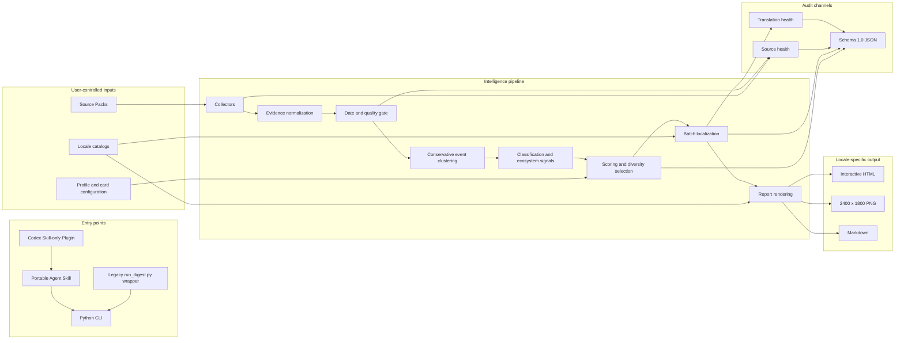

# Architecture

Loyalty Radar packages one local-first intelligence pipeline as a Codex Skill-only Plugin, a portable Agent Skill, and a Python CLI. The implementation stays inside the Skill so copying only that directory retains the complete runtime.

This document describes the `v0.1.0` public-beta architecture and its extension boundaries.

## Design goals

- Collect public loyalty evidence without credentials or anti-bot evasion.
- Preserve source identity, publication time, and collection health.
- Cluster repeated coverage conservatively into auditable events.
- Separate member-level action from structural industry signals.
- Rank against user-controlled interests without committing a personal profile.
- Render English and Simplified Chinese without visible source-language leakage.
- Produce a common JSON audit interface alongside human-readable artifacts.
- Remain portable when the Agent Skill is downloaded without the repository root.

## System view



## Repository layout

```text
loyalty-radar/
├── .agents/plugins/marketplace.json
├── plugins/loyalty-radar/
│   ├── .codex-plugin/plugin.json
│   ├── assets/
│   └── skills/loyalty-radar/
│       ├── SKILL.md
│       ├── agents/openai.yaml
│       ├── scripts/
│       │   ├── run_digest.py
│       │   └── loyalty_radar/
│       └── references/
│           ├── locales/
│           ├── source-packs/
│           └── configuration templates
├── docs/
├── tests/
└── pyproject.toml
```

The root `pyproject.toml` points packaging at the Python package under the Skill. There is no second copy of the implementation at repository root.

## Entry points

| Entry point | Responsibility |
| --- | --- |
| Codex Plugin | Discovery, installation metadata, bilingual starter prompts, and access to the bundled Skill |
| Agent Skill | Domain workflow, safety constraints, expected artifacts, and complete scripts/references bundle |
| `loyalty-radar` CLI | Stable command grammar for initialization, collection, source management, localization, and rendering |
| `run_digest.py` | Temporary adapter for documented legacy arguments; emits deprecation guidance |

The Agent can create the same user configuration as `loyalty-radar init` through conversation. Configuration format, validation, and storage rules remain shared.

## Python module boundaries

The public package is split by responsibility even when a compatibility engine remains during the beta:

| Module | Responsibility |
| --- | --- |
| `cli` | Command parsing, exit codes, orchestration, and deprecation routing |
| `config` | Platform paths, templates, profile/card validation, and migration adapters |
| `sources` | Source Pack loading, schema validation, duplicate detection, and listing |
| `collectors` | Bounded network retrieval and source-specific parsing |
| `models` | Evidence, event, health, localization, and report data structures |
| `classification` | Program, vertical, topic, action, risk, consumer-impact, stakeholder, and ecosystem labels |
| `clustering` | Conservative evidence-to-event grouping and confidence labels |
| `ranking` | Profile relevance, urgency, value, risk, confidence, future dates, and diversity selection |
| `translation` | Batch provider interface, cache isolation, target-language validation, and health |
| `i18n` | Locale-catalog loading and key consistency |
| `rendering` | HTML, Markdown, overview layout, language links, and image fallback |
| `health` | Source funnel counters, failure reasons, and report-level diagnostics |
| `engine` | Internal compatibility surface while legacy logic is decomposed |

New code should depend on the narrow modules rather than adding behavior to the compatibility wrapper.

## Source Packs

The catalog is divided into `core`, `industry`, `forums-global`, `forums-cn`, and `experimental`. Each entry declares source identity, priority, region, language, fetch method, URL, limits, and program/vertical hints.

Pack loading follows these rules:

1. Load packaged defaults.
2. Select packs from user configuration and CLI overrides.
3. Validate IDs, URLs, methods, limits, and duplicate entries before network access.
4. Preserve disabled and browser-assisted entries in source-health output.

Source metadata is configuration. Parser code is executable behavior and therefore receives separate tests and security review.

## Evidence and event model

An **evidence record** represents one source post, article, feed item, comment, or public datapoint. An **event** represents one narrow real-world loyalty change or claim supported by one or more evidence records.

Core evidence fields include:

- source ID, source type, title, URL, publication time, and optional author;
- original summary and source language;
- inferred programs, card families, vertical, topic, metrics, and explicit future dates;
- collection and quality-gate metadata.

Core event fields include:

- stable event identity and canonical link;
- member impact, action label, risk label, and priority;
- vertical and ecosystem signal types;
- stakeholders and impact horizon;
- evidence list, confidence label, score, and score breakdown;
- `original` and `localized` text containers.

Clustering uses exact canonical links first, then narrow title and entity/topic/date/metric similarity. A common program or topic alone is insufficient. Loose transitive matches must not combine unrelated evidence.

## Quality gate and time model

The default run considers evidence published in the previous 14 days. Items in that evidence window may contribute explicit dates during the following 60 days.

Before ranking, the quality gate:

- removes known advertisements, contests, cross-board noise, and irrelevant travel content;
- rejects dated rows outside the configured evidence window;
- distinguishes genuinely undated evidence from incorrectly parsed dates;
- limits and heavily penalizes undated fallback evidence;
- records rejections in the source-health funnel.

Generic openings, routes, reviews, and earnings are excluded unless they materially affect points, status, redemption, co-brand economics, or benefit delivery.

## Classification and ranking

Every selected event belongs primarily to one of two lanes:

- **Member action and risk:** an offer, credit, transfer, redemption, status, lounge, operational issue, clawback, or risk datapoint that a member can use or avoid.
- **Loyalty ecosystem and watchlist:** a structural hotel, airline, card, or rental-car signal with longer-term member impact.

The ecosystem taxonomy includes revenue shifts, reimbursement conflicts, benefit-capacity pressure, devaluation, qualification gatekeeping, partner-contract changes, regulatory pressure, operational reliability, supply-demand stress, and consumer backlash.

Ranking combines profile relevance, urgency, quantified value, risk, evidence confidence, future dates, and ecosystem impact. Diversity selection prevents one prolific source, program, or lane from filling the report when qualified alternatives exist.

## Internationalization and translation

Renderer-owned text comes from `references/locales/zh-CN.yaml` and `references/locales/en.yaml`. Locale catalogs must have identical keys.

Localization occurs after ranking:

1. Select the final events and evidence excerpts.
2. Detect text that is already in the target language.
3. Read or write the provider-specific cache.
4. Translate missing batches through `google-public`, `openai-compatible`, or `none`.
5. Validate output and record cache hits, attempts, fallbacks, and failures.
6. Render only the target locale.

The cache key includes provider, model, source language, target language, and an original-text hash. A failed translation produces a target-language placeholder in HTML, PNG, and Markdown. It never inserts the source text into a visible report.

`google-public` is an unofficial third-party endpoint. Users who require a controlled data boundary should select `none` or configure an `openai-compatible` local endpoint.

## JSON interface

The common audit file uses:

```json
{
  "schema_version": "1.0",
  "generated_at": "<ISO-8601 timestamp>",
  "hours": 336,
  "future_watch_days": 60,
  "items": [
    {
      "event_id": "<event-id>",
      "original": {
        "title": "<original-title>",
        "summary": "<original-summary>"
      },
      "localized": {
        "en": {
          "title": "<localized-English-title>",
          "summary": "<localized-English-summary>"
        },
        "zh-CN": {
          "title": "<本地化中文标题>",
          "summary": "<本地化中文摘要>"
        }
      },
      "evidence": []
    }
  ],
  "health": [],
  "translation_health": {}
}
```

Readers accept documented legacy `title_zh` and `summary_zh` fields during the v0.1 series and normalize them before rendering. Writers emit schema `1.0` only.

## Rendering

The renderer creates one file set per locale:

- full responsive HTML with search, lane/vertical/priority filters, sorting, future timeline, evidence disclosure, and source health;
- 2400 x 1800 horizontal overview PNG with complete titles and adaptive layout;
- Markdown for portable reading;
- overview HTML used for browser image capture when Playwright is available.

The common JSON is generated once. Multi-locale HTML files link to sibling locale files when both were requested.

Playwright is optional. Pillow provides a deterministic PNG fallback, but both paths must honor locale text, title wrapping, and no-overlap constraints.

## Health and observability

Health output is part of the product contract, not debug-only logging.

Each source reports:

- status and reason;
- fetched, dated, eligible, rejected, duplicate, and selected counts;
- whether only titles were available;
- browser-assisted, disabled, blocked, timeout, parse-error, and rate-limit states.

Translation health records provider, model where applicable, requested strings, cache hits, bypassed strings, successful translations, placeholders, failed strings, and request attempts.

No source may turn an access denial or parser error into an empty successful result.

## Trust boundaries

| Boundary | Risk | Required control |
| --- | --- | --- |
| Public source to collector | Malformed content, redirects, oversized responses | URL validation, timeouts, response limits, bounded redirects, explicit parser errors |
| Source text to report | HTML/Markdown/script injection | Context-aware escaping and safe link handling |
| User config to runtime | Invalid paths, URLs, or provider settings | Schema validation and platform-scoped defaults |
| Selected text to translator | Third-party data transmission | Provider disclosure, post-ranking minimization, `none` option, health record |
| JSON to renderer | Legacy or hostile fields | Versioned reader, normalization, type and length checks |
| Renderer to filesystem | Path traversal or overwrite | User-selected output root and controlled filenames |
| Repository to public release | PII, secrets, real reports, restricted content | PII, secret, EXIF, license, and artifact scans |

Collectors never log in, import cookies, solve CAPTCHAs, or bypass access controls. The tool does not provide instructions for violating loyalty-program, bank, merchant, or forum controls.

## Testing strategy

Normal tests are deterministic and offline:

- sanitized parser fixtures;
- classification, clustering, ranking, and future-date fixtures;
- source-pack schema and duplicate-ID failures;
- English/Chinese locale-key parity and missing-translation behavior;
- legacy config, JSON, and CLI compatibility;
- long titles, mobile wrapping, language switching, and output-language leakage;
- Plugin manifest, Skill, build, wheel, and clean-install validation.

A separate scheduled workflow may perform bounded live-source health checks. It uploads audit artifacts, commits no fetched content, and does not block normal pull requests.

This document describes required coverage; it does not assert that a particular checkout or CI run has passed.

## Extension points

- Add a source through Source Pack metadata and a fixture-backed existing collector.
- Add a collector by implementing the registered fetch interface and health contract.
- Add a locale by creating a complete catalog and adding language-leakage tests.
- Add a translation backend through the batch `TranslationProvider` interface.
- Add a renderer by consuming normalized schema `1.0`, not collector internals.
- Add downstream integrations by reading the common JSON rather than scraping HTML.

Hosted accounts, server-side scheduling, email/Telegram delivery, and product telemetry are outside the `v0.1.0` architecture.
